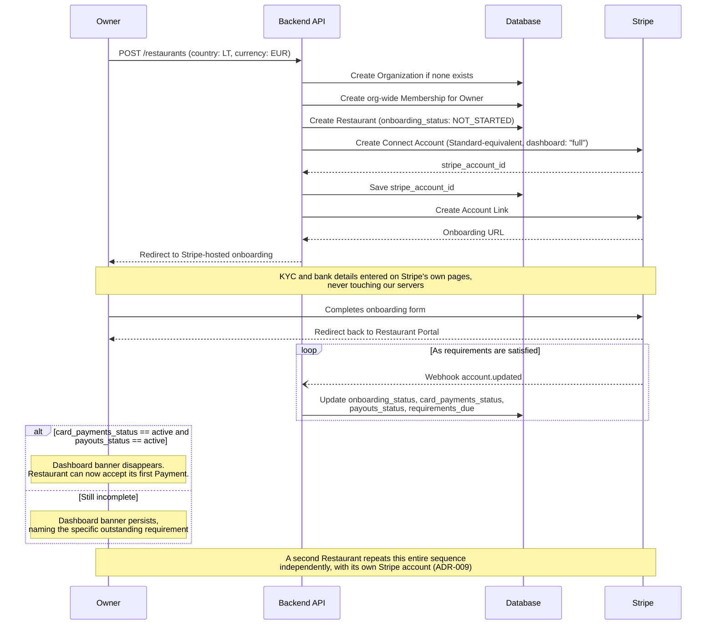

# SEQUENCE — Restaurant Onboarding

Mermaid source. Renders as a diagram when pasted into a chat with Claude or into a Mermaid-aware viewer (e.g. mermaid.live). Kept as `.md` here only because Project Knowledge doesn't accept `.mmd`/`.mermaid` as an upload extension — the content is identical to `SEQUENCE_ONBOARDING.mermaid`.

